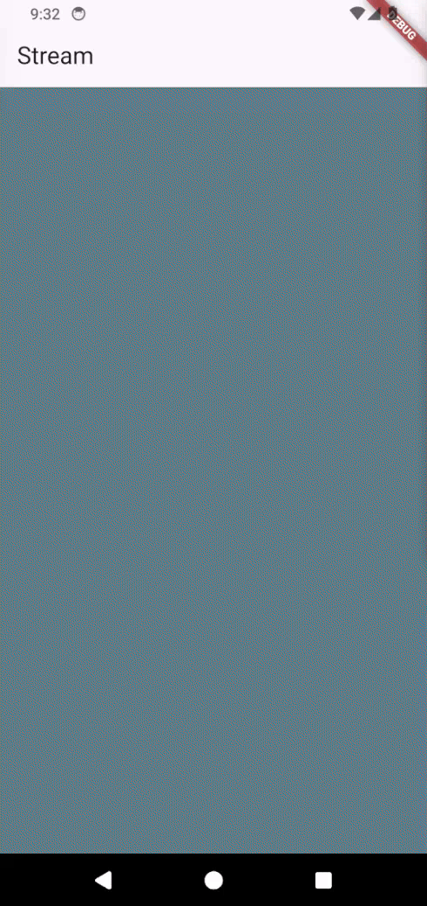
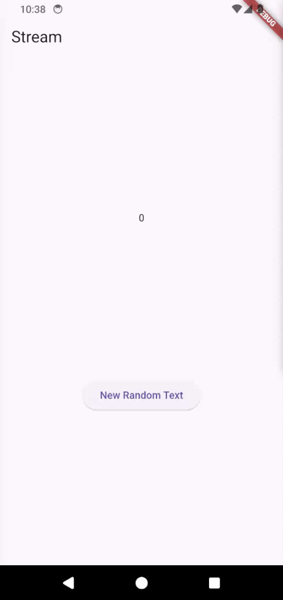
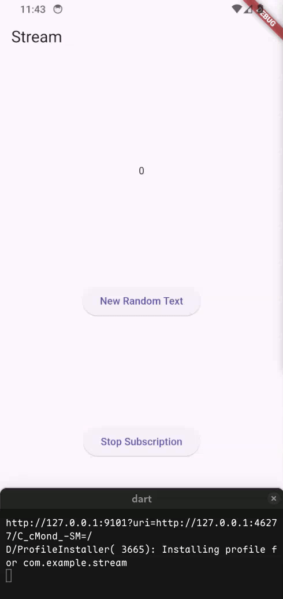
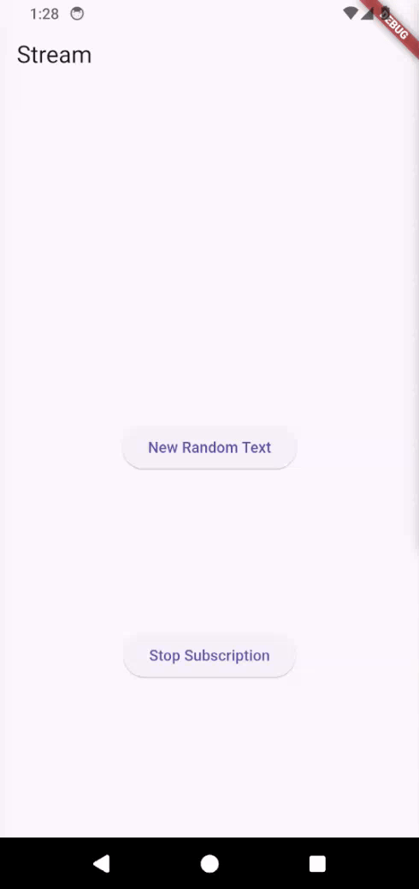

<h3 align="center">Praktikum Flutter - Stream</h3>

Dani Daneswara | 362358302048

#### Branch

- **[main](https://github.com/n0tlikethis/stream/tree/main)**: Soal 1-11
- **[streambuilder](https://github.com/n0tlikethis/stream/tree/streambuilder)**: Soal 12
- **[bloc_random](https://github.com/n0tlikethis/stream/tree/bloc_random)**: Soal 13

#### Hasil
<table>
  <tr>
    <th align="center">Soal 4</th>
    <th align="center">Soal 6</th>
  </tr><tr>
    <td></td>
    <td></td>
  </tr><tr>
    <th align="center">Soal 8</th>
    <th align="center">Soal 9</th>
  </tr><tr>
    <td></td>
    <td></td>
  </tr><tr>
    <th align="center">Soal 10 & 11</th>
  </tr><tr>
    <td></td>
  </tr>
</table>